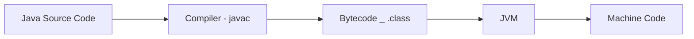

# Day 02 Notes - Java Developer Journey

* Declare and use variables.
* Understand Java data type.
* Take user input using Scanner.
* Create simple employee-related programs.

---

## Variable?

### What is a Variable?
* A variable is a container that store data.
```base
String name = "Suvendu";
int age  = 25;
double salary = 50000.50;
```
* int -> Data type
* name -> Variable name
* Suvendu -> Value

## Java Data Types
* Java has two categories:
1. Primitive Data Type

|Type                   | Size                 |
| --------------------- | -------------------- |
| byte                  | 1 byte (100)         |
| short                 | 2 bytes (20000)      |
| int                   | 4 bytes  (100000)    |
| long                  | 8 bytes (99999999)   |
| float                 | 4 byte (10.5f)       |
| double                | 8 byte (10.5678)     |
| char                  | 2 byte ( 'A' )       |
| boolean               | 1bit (true/false)    |

### Example Program
```
public class DataType {
    public static void main(String[] args){
        int age = 25; // Integer data type
        double salary = 1000.50; // Double data type
        char grade = 'A'; // Character data type
        boolean isEmployed = true; // Boolean data type

        System.out.println("Age: " + age);
        System.out.println("Salary: " + salary);
        System.out.println("Grade: " + grade);
        System.out.println("Is Employed: " + isEmployed);

    }
}
```
* Output
```
D:\Java-Journey\Week-01\Day-02> java DataType.java
Age:25
Salary: 1000.5                            
Grade: A
Is Employed: true
```
---

## String Daya type
* String store text.
```
String name = "Suvendu Mondal";
```
* Example 
```
public class StringDemo {
    public static void main(String[] args) {
        String name = "Suvendu Mondal"; // String data type
        String city = "Kolkata"; // String data type
        System.out.println("Name: " + name);
        System.out.println("City: " + city);
    }
}
```
* output
```
Name: Suvendu Mondal
City: Kolkata
```
---


# Java Interview Questions

### 1. Tell Me About Yourself
* Good morning sir/madam,
    My name is Suvendu Mondal. I am currently working as PHP Developer and have experience in Codelgniter framework development.
    My responsibilities include developing web applications, database design, API integration, bug fixing, and application maintenance.
    To expand my career opportunities in enterprise application development, I am currently learning Java and Spring Boot.
    I am passionate about learning new technologies and solving real-world business problems though software development.
    My goal is to work as a Java Developer in a reputed organization like MNC and contribute to large-scale enterprise Projects.

### 2. Why Do You Want to Switch from PHP to Java?
* PHP is a good technology for web development, and I have gained valuable experience working with it.
  However, Java is widely used in enterprise application, banking systems, insurance system, and large-scale business solution.
  I want to work on highly scalable enterprise applications, and Java Spring Boot provieds excellent opportunities for that.
  Theerefore, I am upgrading my skills from PHP to Java.
### 3. What is the Java?
* Java is a high-lavel, object-oriented, platform-independent programming language developed by Sun Microsystems.
  Java follows the principle:
  "Write Once, Run Anywhere."
  Java code is complied into bytecode, which runs on the Java virtual Machine (JVM).
    ### Key Featurs
    * Object-Oriented
    * Platform Independent
    * Secure
    * Robust
    * Multithreaded
    * Portable
### 4. What is JVM?
* JVM stands for Java Virtual Machine.
  It is responsible for executing Java bytecode.
  JVM converts bytecode into machine code and allows Java programs to run on different operating systems without modification.
  ### Flow
    Java Source Code -> Compiler (javac) -> Bytecode(.class) -> JVM -> Machine Code



 


