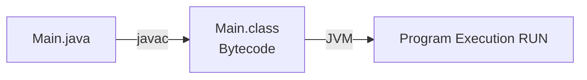
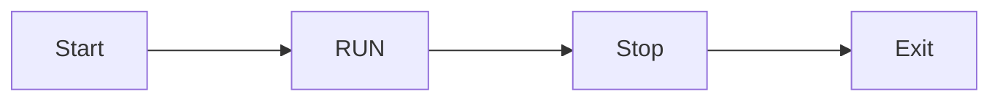
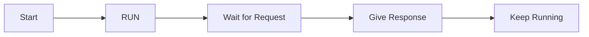
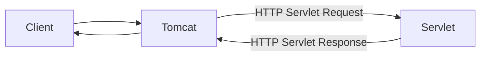
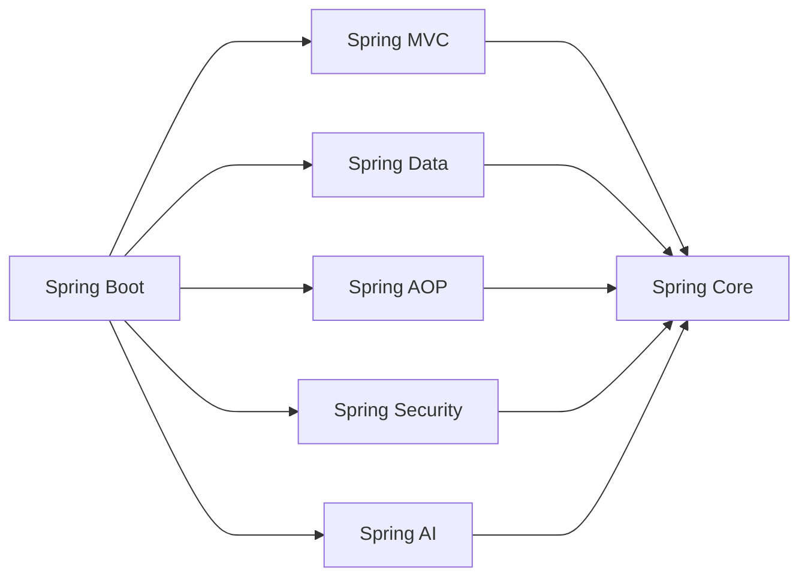
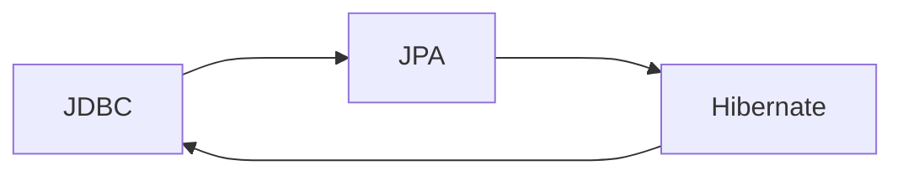
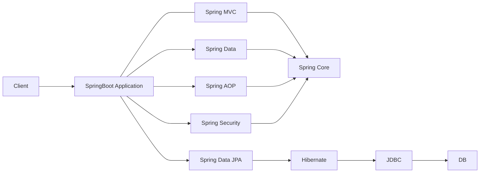

# Spring Framework

User -> (Request) Server
User <- (Response) Server

### Client Server Architecture

    Client -> (HTTP/HTTPS Request)  -> Server
    Client <- (HTTP/HTTPS Request)  <- Server
    Client(is Mobile app, React, Android/Ios, postman, server)

    HTTP(Hyper Text Transfer Protocol)
    -> Request Structure?
    -> Response Structure?
    -> GET, POST, DELETE, PUT, PATCH
    -> How data will be sent?

    Request:
    -> Method Name (Get,POST,..)
    -> URL/Path (www.amazon.in)
    -> Headers : (accept : application/json)
    -> Body ({} )
    Response :
    -> Status code(200 ok, 201, 503, ....)
    -> Hraders (ContenType : application/json)
    -> Body {
        message: "Login Successfull"
        }

# Java Compilation Process

# Code Flow

# Website Flow

## Core Java Networking problem

ServerSocket server = new ServerSocket(8080)
GET : /coures
Host: localhost:8080 (127.0.0.1)
---> java.net ---> BR--->

1. Read I/P streams
2. Pass request Manually
3. Map a Method to an end point
4. Manally build HTTP Response
5. Multiple Threading

## Servlet & Servlet Container

1997 ---> Java EE
server -> Tomcat (Servlet Container), Jetty, Undertoo

Servlet Container (Tomcat)

Client (Browser)
|
| HTTP Request
v
+-----------------------+
| Servlet Container |
| (Tomcat) |
+-----------------------+
|
| 1. Open Port (8080)
| 2. Listen for Requests
| 3. Read Incoming Bytes
| 4. Parse HTTP Request
| 5. Create HttpServletRequest
| 6. Allocate/Manage Thread
| 7. Call Servlet (doGet/doPost)
| 8. Generate Response
| 9. Create HttpServletResponse
v
Client (Browser)

# Spring Framework

## Spring Data (JDBC -> JPA)

